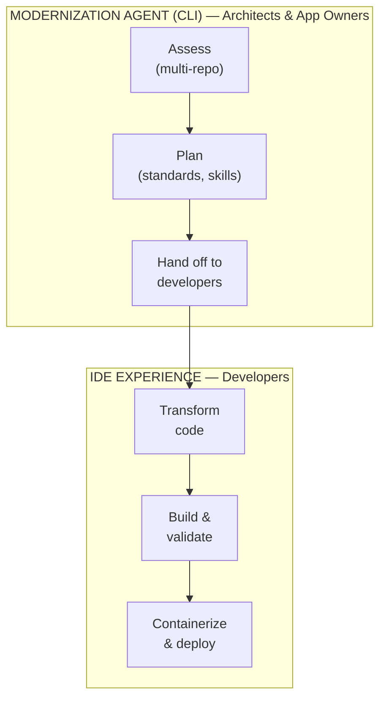

# GitHub Copilot Modernization — Overview & Architecture

> *Last reviewed against [official documentation](https://learn.microsoft.com/en-us/azure/developer/github-copilot-app-modernization/): April 2026*

## What Is It?

GitHub Copilot modernization is an **agentic, end-to-end solution** that analyzes, upgrades, and migrates **Java** and **.NET** applications to Azure. It combines AI-powered intelligence with deterministic automation to modernize applications from assessment through deployment.

**Key Principle**: Humans remain in the loop throughout — every recommendation is transparent, every change is reviewable, and every step is validated.

## Two Complementary Layers

GitHub Copilot modernization is delivered through **two complementary layers** that work together:

### 1. Modernization Agent (CLI Experience)

- **Delivered via**: The `modernize` CLI (Modernize CLI)
- **Target users**: Architects, application owners, platform teams
- **Purpose**: Orchestrate assessment, migration planning, and framework upgrade automation across **multiple applications simultaneously**
- **Availability**: **Public Preview**
- **Key strength**: Enterprise-scale operations, batch processing, CI/CD integration

### 2. IDE Experience

- **Delivered via**: VS Code extensions, Visual Studio, IntelliJ IDEA, GitHub Copilot CLI, GitHub.com
- **Target users**: Developers
- **Purpose**: Execute transformations — migrating dependencies, containerizing apps, generating IaC, deploying to Azure
- **Availability**: **General Availability** for language/framework upgrades and migration scenarios
- **Key strength**: Interactive, developer-centric workflow with deep IDE integration

### How They Work Together



<details>
<summary>ASCII version (for terminals)</summary>

```
┌─────────────────────────────────────────────────────────────┐
│            MODERNIZATION AGENT (CLI)                         │
│  Architects & App Owners                                     │
│  ┌──────────┐  ┌──────────────┐  ┌─────────────────┐       │
│  │  Assess   │→│  Plan        │→│  Hand off to     │       │
│  │  (multi-  │  │  (standards, │  │  developers      │       │
│  │   repo)   │  │   skills)    │  │                  │       │
│  └──────────┘  └──────────────┘  └────────┬────────┘       │
└───────────────────────────────────────────┼─────────────────┘
                                            │
                                            ▼
┌─────────────────────────────────────────────────────────────┐
│            IDE EXPERIENCE                                    │
│  Developers                                                  │
│  ┌──────────────┐  ┌──────────────┐  ┌─────────────────┐   │
│  │  Transform   │→│  Build &     │→│  Containerize   │   │
│  │  code        │  │  validate    │  │  & deploy       │   │
│  └──────────────┘  └──────────────┘  └─────────────────┘   │
└─────────────────────────────────────────────────────────────┘
```

</details>

## Core Workflow: Assess → Plan → Execute

The entire modernization process follows a **three-stage workflow**:

### Stage 1: Assessment
- Analyzes code, configuration, and dependencies
- Identifies outdated frameworks, deprecated APIs, migration opportunities
- Generates comprehensive reports (per-app and aggregated for batch)
- Produces cloud readiness scores

### Stage 2: Planning
- Converts assessment into detailed, reviewable modernization plans
- Documents upgrade strategies, refactoring approaches, dependency paths, and risk mitigations
- Breaks plans into ordered, executable steps with success criteria
- Plans are editable — humans can modify before execution

### Stage 3: Execution
- Applies code transformations automatically
- Validates builds after each change
- Scans for and addresses CVEs (Common Vulnerabilities and Exposures)
- Creates Git commits for traceability
- Generates summary reports

## Key Capabilities

### 1. Application Assessment and Planning
- Comprehensive codebase analysis
- Dependency identification and outdated library detection
- Actionable strategies for remediation
- Cross-repository analysis and dependency mapping

### 2. Code Transformations
- Uses **OpenRewrite** for deterministic upgrades (API replacements, dependency updates)
- AI-powered predefined tasks for common Azure migration scenarios
- Custom skills for organization-specific patterns
- Migration patterns reusable across codebases

### 3. Build, Patching, and Tests
- Automatic build validation and error resolution
- Unit test migration and generation
- CVE scanning and automatic security fix application
- Production pipeline integrity maintenance

### 4. Containerization and Deployment
- Dockerfile generation for app containerization
- Infrastructure as Code (IaC) file creation
- CI/CD pipeline setup
- Direct deployment to Azure services

## Supported Languages and Frameworks

| Language | Build Systems | Framework Focus |
|----------|---------------|-----------------|
| **Java** | Maven, Gradle (Wrapper v5+) | Spring Boot (up to 3.5), Java EE/Jakarta EE (up to 10), JUnit |
| **.NET** | MSBuild (.csproj, .sln) | ASP.NET Core, Blazor, Azure Functions, WPF, WinForms, .NET Framework |

### Java Version Support

**Supported source versions:** JDK 8, 11, 17, 21, 25
**Upgrade target:** up to JDK 21

> **Note:** JDK 25 is recognized as a source version (the tool can analyze JDK 25 projects) but the maximum upgrade target is currently JDK 21. See the [official FAQ](https://learn.microsoft.com/en-us/azure/developer/java/migration/migrate-github-copilot-app-modernization-for-java-faq) for the latest supported versions.

### .NET Version Support
- .NET Framework → .NET (modern)
- Older .NET versions → Latest .NET (e.g., .NET 10)

## Azure Target Platforms

After modernization, applications can deploy to:
- **Azure App Service** — Fully managed web hosting
- **Azure Container Apps** — Serverless container platform
- **Azure Kubernetes Service (AKS)** — Managed Kubernetes
- **AKS Automatic** — Simplified Kubernetes with automated management

## Post-Modernization AI Integration

Modernized Azure apps can integrate with:
- **Microsoft Foundry** — Access to 11,000+ AI models
- **AI Agent Services** — Intelligent application features
- **Azure Monitor** — Real-time performance insights
- **Content Safety** — Responsible AI implementation

## Privacy and Data Handling

- **No code retention** beyond the immediate session
- **No custom skills collection** — skills are not transmitted or stored
- **No model training** on user code
- Session data is deleted after upgrade/migration completes
- Standard GitHub Copilot subscription billing (premium requests consumed)

## Licensing

Available to **any GitHub Copilot plan**:
- Copilot Free (VS 2026 v18.1+)
- Copilot Pro / Pro+
- Copilot Business
- Copilot Enterprise

Billing follows GitHub Copilot's subscription model with premium request consumption.
